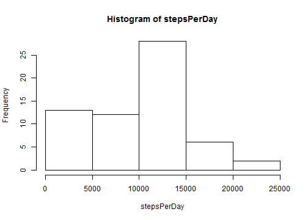
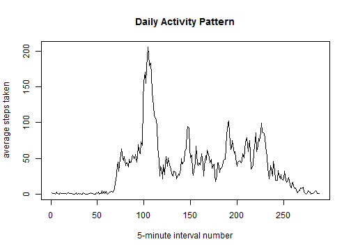
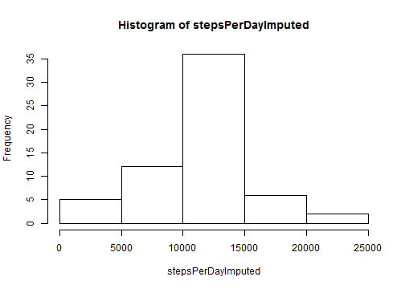
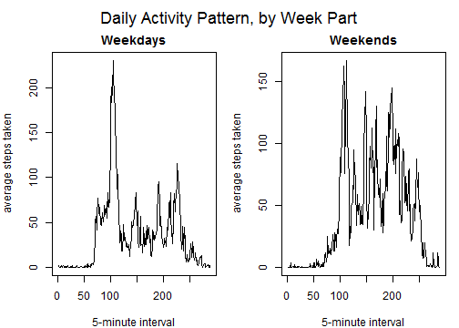

## Loading and preprocessing the data
First load the activity data and see what we have:

```r
if (!file.exists('activity.csv')) unzip('activity.zip')
dat <- read.csv('activity.csv')
str(dat)
```

```
## 'data.frame':	17568 obs. of  3 variables:
##  $ steps   : int  NA NA NA NA NA NA NA NA NA NA ...
##  $ date    : Factor w/ 61 levels "2012-10-01","2012-10-02",..: 1 1 1 1 1 1 1 1 1 1 ...
##  $ interval: int  0 5 10 15 20 25 30 35 40 45 ...
```

```r
head(dat)
```

```
##   steps       date interval
## 1    NA 2012-10-01        0
## 2    NA 2012-10-01        5
## 3    NA 2012-10-01       10
## 4    NA 2012-10-01       15
## 5    NA 2012-10-01       20
## 6    NA 2012-10-01       25
```

## What is mean total number of steps taken per day?

Calculate the total number of steps taken each day.

First use **tapply** to obtain per-day step subtotals, 
ignoring missing values. Then sum the per-day subtotals.

```r
stepsPerDay <- tapply(dat$steps, dat$date, 
                      function(v) sum(v, na.rm=T))
sum(stepsPerDay)
```

```
## [1] 570608
```

Plot a histogram of steps per day:

```r
hist(stepsPerDay)
```

 

Calculate the mean and median steps per day:

```r
mean(stepsPerDay)
```

```
## [1] 9354.23
```

```r
median(stepsPerDay)
```

```
## [1] 10395
```

## What is the average daily activity pattern?

Make a time series plot (i.e. ```type="l")``` of the 5-minute interval (x-axis) and the average number of steps taken, averaged across all days (y-axis).

First use **tapply** to calculate the average number steps taken in each time interval, then plot those data as a time series.

```r
intervalAvgs <- tapply(dat$steps, dat$interval, 
                       function(v) mean(v, na.rm=TRUE))
plot(intervalAvgs, type="l", main="Daily Activity Pattern",
     xlab="5-minute interval number", 
     ylab="average steps taken")
```

 

Which 5-minute interval, on average across all the dataset days, 
contains the most steps?

```r
index <- which.max(intervalAvgs)
intervalAvgs[index]
```

```
##      835 
## 206.1698
```
Interval ID 835 (which represents 8:35 AM) has the highest average step count.

## Imputing missing values

Calculate and report the total number of missing values:

```r
length(which(is.na(dat)))
```

```
## [1] 2304
```

Devise and implement a strategy for filling in all of the missing values 
in the dataset. Here, we will just use the average 5-minute interval value to
replace any intervals that are NAs.


```r
dat2 <- dat
dat2$steps <- ifelse(is.na(dat$steps),
                     intervalAvgs[as.character(dat$interval)],
                     dat$steps)
length(which(is.na(dat2)))
```

```
## [1] 0
```

Plot histogram of data with these imputed values:

```r
stepsPerDayImputed <- tapply(dat2$steps, dat2$date, sum)
hist(stepsPerDayImputed)
```

 

Report mean and median on the imputed data:

```r
mean(stepsPerDayImputed)
```

```
## [1] 10766.19
```

```r
median(stepsPerDayImputed)
```

```
## [1] 10766.19
```

Both the mean and median total steps per day are higher for the imputed data 
than for the original data. The histogram plots show why: the missing values
in the original data appeared as 0 steps, skewing the histogram to the left
compared to the histogram on the imputed data. 
So this imputation has produced a more normal distribution of 
total steps per day.

## Are there differences in activity patterns between weekdays and weekends?

Create a new factor variable in the dataset with two levels – **weekday** and
**weekend** indicating whether a given date is a weekday or weekend day.


```r
dat2$dayOfWeek <- weekdays(as.Date(dat2$date))
dat2$weekPart  <- ifelse(dat2$dayOfWeek %in% c('Saturday','Sunday'),
                        'weekend', 'weekday')
dat2$weekPart  <- factor(dat2$weekPart, levels=c('weekday', 'weekend'),
                         ordered=TRUE)
head(dat2)
```

```
##       steps       date interval dayOfWeek weekPart
## 1 1.7169811 2012-10-01        0    Monday  weekday
## 2 0.3396226 2012-10-01        5    Monday  weekday
## 3 0.1320755 2012-10-01       10    Monday  weekday
## 4 0.1509434 2012-10-01       15    Monday  weekday
## 5 0.0754717 2012-10-01       20    Monday  weekday
## 6 2.0943396 2012-10-01       25    Monday  weekday
```

Make a panel plot showing average steps taken in each 5-minute 
interval, showing the time-series trend for weekdays versus weekends.

First calculated the interval averages for weekdays and weekends.

```r
tmp1      <- dat2[dat2$weekPart == 'weekday',]
wkDayAvgs <- tapply(tmp1$steps, tmp1$interval, mean)
tmp2      <- dat2[dat2$weekPart == 'weekend',]
wkEndAvgs <- tapply(tmp2$steps, tmp2$interval, mean)
```

Now plot the data side by side.

```r
par(mfrow=c(1,2), mar=c(4,4,2,1), oma=c(0,0,2,0))
plot(wkDayAvgs, type="l", main="Weekdays",
     xlab="5-minute interval", 
     ylab="average steps taken")
plot(wkEndAvgs, type="l", main="Weekends",
     xlab="5-minute interval", 
     ylab="average steps taken")
 mtext("Daily Activity Pattern, by Week Part", outer=T, cex=1.5)
```

 
